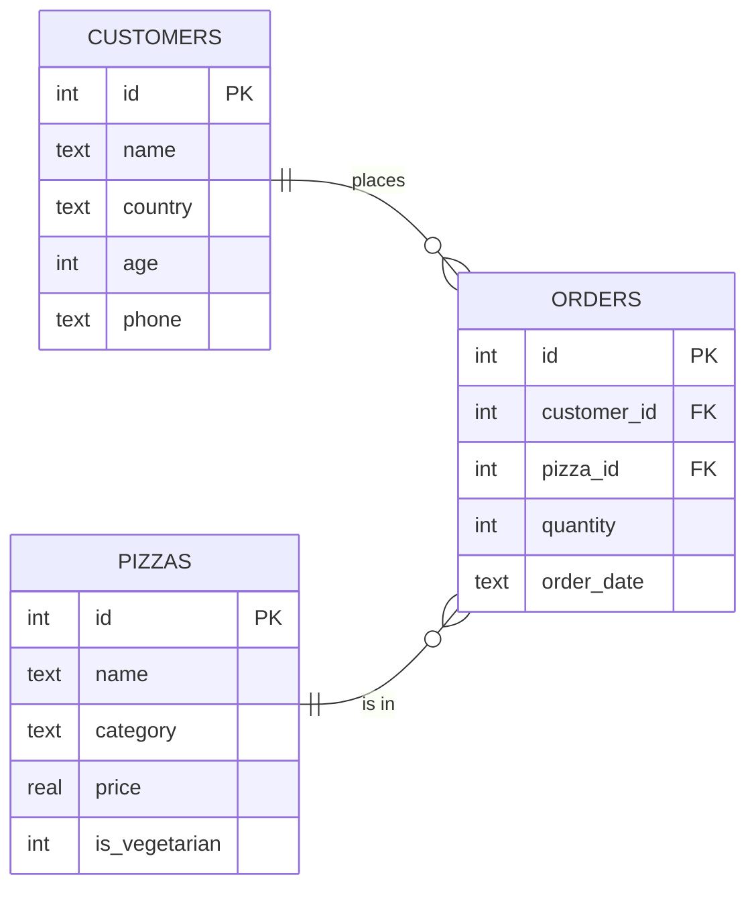

# Data & Databases

---
clicks: 3
---

# Data is everywhere 🌍

<div class="mt-6 grid-auto cols-3">
  <div v-click="1" class="card">
    <div class="big">📱</div>
    <h3>Your phone</h3>
    Contacts: <i>name, number, photo</i>
  </div>
  <div v-click="2" class="card red">
    <div class="big">🎬</div>
    <h3>A streaming app</h3>
    Movies: <i>title, year, rating</i>
  </div>
  <div v-click="3" class="card green">
    <div class="big">🏦</div>
    <h3>A bank</h3>
    Payments: <i>who, how much, when</i>
  </div>
</div>

<div v-click="3" class="mt-10 text-center text-xl">
Behind each app there is a <b class="text-[var(--pp-red)]">database</b>.<br>
And to talk to a database, we use <b class="text-[var(--pp-red)]">SQL</b>.
</div>

---

# A spreadsheet? Almost! 📊

<div class="grid-auto cols-2 mt-4">

<div class="card">

### Spreadsheet (Excel)
- 👤 One person at a time
- 🐌 Slow with huge files
- 🤷 Anything can go in any cell
- 📄 Hard to connect many sheets

</div>

<div v-click class="card red">

### Database
- 👥 Thousands of users at the same time
- 🚀 Millions of rows, still fast
- 📏 Strict **rules** (a price is a number)
- 🔗 Tables are **connected**

</div>

</div>

<Callout v-click type="chef">

Good news: if you understand a spreadsheet, you already understand 70% of a database!

</Callout>

---
clicks: 4
---

# Anatomy of a table 🔬

<div class="grid-auto mt-2" style="grid-template-columns: auto 1fr; align-items: center; gap: 1.6rem">

<ResultTable
  title="pizzas"
  :columns="['id', 'name', 'category', 'price']"
  :rows="[[1, 'Margherita', 'classic', 8], [2, 'Pepperoni', 'meat', 10.5], [3, 'Diavola', 'spicy', 11.5], [4, 'Marinara', 'classic', 7]]"
  :hl-col="$clicks === 1 ? 2 : $clicks === 4 ? 0 : $clicks === 3 ? 1 : -1"
  :hl-row="$clicks === 2 || $clicks === 3 ? 1 : -1"
  style="font-size: 1.25rem"
/>

<div class="text-lg leading-loose">
  <div v-click="1">🟥 <b>Column</b> = one kind of information</div>
  <div v-click="2">🟧 <b>Row</b> = one thing (a "record")</div>
  <div v-click="3">🟨 <b>Cell</b> = one single value</div>
  <div v-click="4">🔑 <b>Primary key</b> = a unique ID for each row</div>
</div>

</div>

<!--
Click 1: highlight the "category" column. Click 2: the Pepperoni row. Click 3: the cell "Pepperoni". Click 4: the id column.
-->

---

# What is a database? 🏠

<div class="grid-auto cols-2 mt-2" style="align-items: center">

<div>

A **database** is a *collection of tables*.

<v-clicks>

- Our pizzeria has **3 tables**
- Each table talks about **one topic**
- A program called a **DBMS** keeps everything safe and fast

</v-clicks>

</div>

<div v-click class="card text-center">

### Popular DBMS 🏭

<div class="mt-3 leading-loose font-bold text-lg">
SQLite &nbsp;·&nbsp; PostgreSQL<br>
MySQL &nbsp;·&nbsp; SQL Server<br>
Oracle &nbsp;·&nbsp; MariaDB
</div>

</div>

</div>

<Callout v-click type="chef" title="One language, many accents 🗣️">

They all speak SQL, with tiny differences, like British and American English.
In this course we use **SQLite**.

</Callout>

---
layout: two-cols
---

# What is SQL? 💬

**S**tructured **Q**uery **L**anguage

Say "S-Q-L" or "sequel". Both are OK!

<v-clicks>

- **Query** = a question to the database
- **Language** = words and rules
- You say **WHAT** you want
- The database finds **HOW**

</v-clicks>

::right::

<div class="pl-6 pt-6">

<div v-click class="card">

### 🍕 In a restaurant
> "One Margherita, please."

You don't go to the kitchen to cook!

</div>

<div v-click class="card red mt-4">

### 🗄️ In a database
```sql
SELECT * FROM pizzas
WHERE name = 'Margherita';
```

You ask. The database cooks. 🧑‍🍳

</div>

</div>

---
clicks: 3
---

# What can SQL do? 🛠️

<div class="mt-8 grid-auto cols-3">

<div v-click="1" class="card green">
  <div class="big">🔍</div>
  <h3>READ data</h3>
  <code>SELECT</code>
  <div class="mt-2 text-sm">Ask questions: "Which pizzas cost less than 10?"</div>
</div>

<div v-click="2" class="card">
  <div class="big">✏️</div>
  <h3>CHANGE data</h3>
  <code>INSERT</code> <code>UPDATE</code> <code>DELETE</code>
  <div class="mt-2 text-sm">Add, edit and remove rows.</div>
</div>

<div v-click="3" class="card purple">
  <div class="big">🏗️</div>
  <h3>BUILD tables</h3>
  <code>CREATE</code> <code>DROP</code>
  <div class="mt-2 text-sm">Create or remove whole tables.</div>
</div>

</div>

<div v-click="1" class="mt-8 text-center text-lg">
80% of the time, people use <b class="text-[var(--pp-red)]">SELECT</b>. We start there! 🚀
</div>

---

# Meet Pizza Planet 🍕🪐

<div class="flex justify-center">



</div>

<div class="grid-auto cols-3 text-center">
  <div v-click>🌍 <b>customers</b><br><span class="text-sm opacity-80">13 people from 11 countries</span></div>
  <div v-click>🧾 <b>orders</b><br><span class="text-sm opacity-80">24 orders: who ordered what</span></div>
  <div v-click>🍕 <b>pizzas</b><br><span class="text-sm opacity-80">9 pizzas on the menu</span></div>
</div>

<!--
This is the dataset used for the whole course. PK = primary key, FK = foreign key (we explain them in chapter 6).
-->

---

# Let's look at the data! 👀

Change the table name: `pizzas` → `customers` → `orders`. Press **▶ Run**.

<SqlPlayground
  query="SELECT * FROM pizzas;"
  schema
  :max-height="240"
/>
